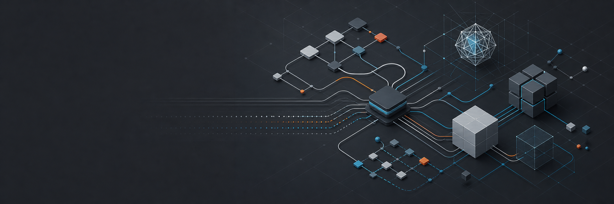

<!-- markdownlint-disable MD013 -->

# Hal Long

Pipeline TD/TA | DCC-MCP author | AI-native creative systems | Rust + Python

I build dependable software for creative production. My work connects DCC applications, AI-native
protocols, and cross-platform developer tooling so artists and engineers can ship with less friction.

[LinkedIn](https://www.linkedin.com/in/hal-long/) | [IMDb](https://www.imdb.com/name/nm7805574/?ref_=ra_gb_ln) | [Vimeo](https://vimeo.com/loong) | [GitHub](https://github.com/loonghao) |  

## What I work on

Pipeline TD/TA based in Shenzhen with 12+ years across VFX and game development. I work at the
boundary between artist workflows and production-grade software, from Python APIs inside creative
applications to Rust services, packaging, and MCP integrations.

| Area | Focus |
| :--- | :--- |
| Creative tooling | DCC APIs, plugin systems, workflow automation, and artist-facing tools |
| AI-native integration | MCP servers, structured tool interfaces, and desktop application bridges |
| Developer infrastructure | Rust and Python interop, IPC, packaging, CI/CD, containers, and release workflows |

## Why AI-native

AI-native does not mean placing a chatbot on top of an old workflow. It means designing software so
an AI system can understand context, call the right tools, respect production rules, and help people
move faster without breaking the creative process.

## Selected open source work

These projects represent the systems I like to build: practical tools with a clear boundary between
creative software, automation, and reliable infrastructure. Stars and forks update directly from GitHub.

| Project | What it does | Community signal |
| :--- | :--- | :--- |
| [Photoshop Python API](https://github.com/loonghao/photoshop-python-api) | Python API for Photoshop automation and production workflows. |   |
| [Photoshop MCP Server](https://github.com/loonghao/photoshop-python-api-mcp-server) | Connects AI assistants and MCP clients to Adobe Photoshop through a structured server interface. |   |
| [Maya Umbrella](https://github.com/loonghao/maya_umbrella) | Maya security tooling for detecting and removing malicious content. |   |
| [ShotGrid MCP Server](https://github.com/loonghao/shotgrid-mcp-server) | MCP access to ShotGrid and Flow Production Tracking data for production workflows. |   |
| [AuroraView](https://github.com/loonghao/auroraview) | Lightweight cross-platform WebView infrastructure for DCC applications, built with Rust and Python bindings. |   |
| [vx](https://github.com/loonghao/vx) | Universal development tool manager for reproducible, cross-platform toolchains. |   |

## DCC-MCP ecosystem

I am the author of the open source [DCC-MCP ecosystem](https://github.com/dcc-mcp), a shared
interface for connecting creative applications such as Maya, Houdini, 3ds Max, Nuke, Photoshop,
and Unreal to structured automation workflows.

Explore the [DCC-MCP Core](https://github.com/dcc-mcp/dcc-mcp-core), [Maya adapter](https://github.com/dcc-mcp/dcc-mcp-maya),
[Houdini adapter](https://github.com/dcc-mcp/dcc-mcp-houdini), and [Photoshop adapter](https://github.com/dcc-mcp/dcc-mcp-photoshop).

## Toolbox

**Languages:** Rust, Python, TypeScript, Go

**Creative applications:** Maya, Houdini, Nuke, 3ds Max, Photoshop, ShotGrid, Unreal Engine

**Engineering:** FastAPI, PySide, Docker, Kubernetes, GitHub Actions, Jenkins, IPC, WebView, MCP

## Collaboration

I enjoy collaborating on:

- AI-native creative pipelines for games, film, advertising, and interactive production
- Maintainable automation for DCC tools, asset systems, and production management platforms
- MCP servers and agent workflows connected to real production context
- Multi-language systems with clear boundaries and long-term maintainability

[Browse all repositories](https://github.com/loonghao?tab=repositories) | [Start a conversation](https://www.linkedin.com/in/hal-long/)

Profile links and project signals are maintained as the work evolves.
